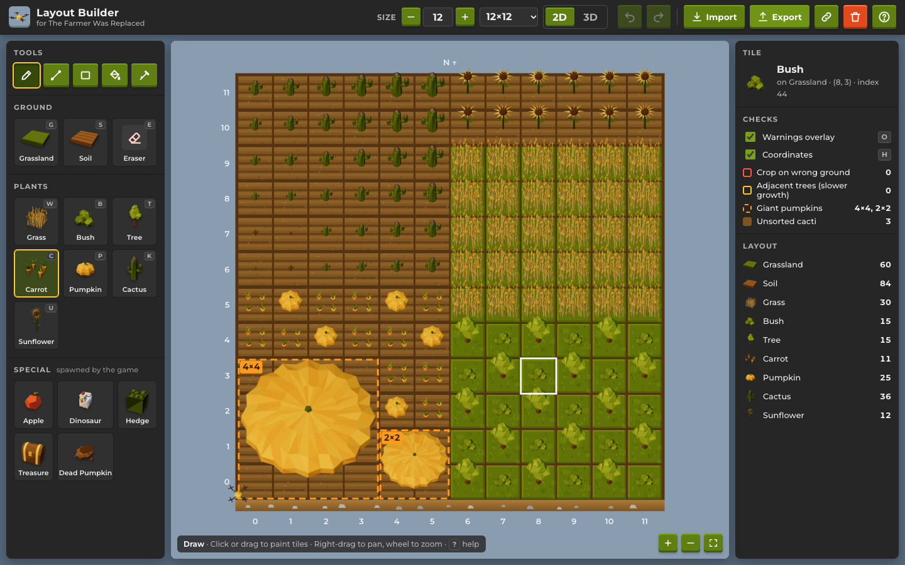

# The Farmer Was Replaced – Layout Builder

A web editor for planning farm layouts in [The Farmer Was Replaced](https://store.steampowered.com/app/2060160/The_Farmer_Was_Replaced/).
Paint grounds and plants on a grid, check the layout against the game's rules, and export it as
paste-ready Python that your drone scripts can read.




## Features

- **2D and 3D views, same editor.** Every tool, overlay, shortcut and undo step works the same in
  both; press <kbd>V</kbd> to switch. The 3D view is modelled on the game: an earth slab, olive
  grassland, ploughed soil, low-poly plants, a hovering drone and a warm sun.
- **Game-accurate data.** Grounds: Grassland, Soil. Plants: Grass, Bush, Tree (any ground) and
  Carrot, Pumpkin, Cactus, Sunflower (soil only; painting them on grassland tills it to soil).
  Special entities the game spawns (Apple, Dinosaur, Hedge, Treasure, Dead Pumpkin) are in their
  own section. The table is data-driven (`src/core/entities.js`).
- **Per-tile parameters.** Cactus size (0–9) and sunflower petals (7–15) are stored per tile, shown
  in both views (cactus height, petal count) and exported.
- **Tools.** Draw, line (<kbd>Shift</kbd> snaps to 45°), rectangle (<kbd>Shift</kbd> for outline),
  flood fill and pick (or <kbd>Alt</kbd>+click). Undo/redo with <kbd>Ctrl/⌘</kbd>+<kbd>Z</kbd>,
  <kbd>Shift</kbd>+<kbd>Ctrl/⌘</kbd>+<kbd>Z</kbd> or <kbd>Ctrl/⌘</kbd>+<kbd>Y</kbd>. Press <kbd>?</kbd>
  for all shortcuts.
- **Checks.** Soil crops on grassland (from imported data), orthogonally adjacent trees (each
  neighbour doubles growth time), the giant pumpkins your pumpkin squares will merge into, and
  cacti that aren't in sorted order (shown brown, like in the game).
- **Any size from 3×3 to 32×32**, with presets for the farm expansion sizes. Resizing keeps
  everything anchored at the south-west corner.
- **Export / import** as Python (for the game) or JSON, with a paste box. Layouts autosave to
  `localStorage`, and the link button copies a compact share URL (`#layout=…`).

Coordinates match the game: `(0, 0)` is the south-west corner, `x` grows East, `y` grows North,
and the tile at `(x, y)` is `grid[y * size + x]`.

## Using the export in the game

**Export → Python (game)** produces a file like this (one tile per line, south row first):

```python
# Farm layout 3x3, made with the TFWR Layout Builder.
# grid[y * grid_size + x] is the tile at (x, y); (0, 0) is the south-west corner.
# Rows go south to north, 3 tiles per row.
grid_size = 3
grid = [
	{"ground": Grounds.Soil, "entity": Entities.Carrot},
	{"ground": Grounds.Soil, "entity": Entities.Cactus, "size": 4},
	{"ground": Grounds.Soil, "entity": Entities.Sunflower, "petals": 12},
	{"ground": Grounds.Grassland, "entity": Entities.Tree},
	{"ground": Grounds.Grassland, "entity": None},
	...
]
```

`"size"` (cactus) and `"petals"` (sunflower) only appear for those entities. The game decides them
randomly when a plant grows, so treat them as targets you can compare with `measure()`.

Paste it into a code window named `layout`, add the three modules below, and run:

```python
import layout
import mod_farm

mod_farm.do_farm(layout.grid, layout.grid_size)
```

### Drone scripts

```python
# mod_globals

def index_to_coords(index):
	size = get_world_size()
	return (index % size, index // size)

def coords_to_index(x, y):
	return y * get_world_size() + x
```

```python
# mod_move

import mod_globals

# Signed number of steps from `current` to `target` on an axis that wraps around.
def wrap_steps(current, target, size):
	diff = target - current
	if diff > size // 2:
		diff = diff - size
	elif diff < -(size // 2):
		diff = diff + size
	return diff

def move_to_pos(x, y):
	size = get_world_size()
	dx = wrap_steps(get_pos_x(), x, size)
	dy = wrap_steps(get_pos_y(), y, size)
	for i in range(abs(dx)):
		if dx > 0:
			move(East)
		else:
			move(West)
	for i in range(abs(dy)):
		if dy > 0:
			move(North)
		else:
			move(South)

def move_to_index(index):
	x, y = mod_globals.index_to_coords(index)
	move_to_pos(x, y)
```

```python
# mod_farm

import mod_move

# Entities the drone can plant. Apples, dinosaurs, hedges, treasure and dead
# pumpkins are spawned by the game, so they are skipped.
PLANTABLE = {Entities.Grass, Entities.Bush, Entities.Tree, Entities.Carrot, Entities.Pumpkin, Entities.Cactus, Entities.Sunflower}

def do_tile(tile):
	ground = tile["ground"]
	entity = tile["entity"]
	current = get_entity_type()

	if can_harvest():
		harvest()
		current = get_entity_type()
	elif current != None and current != entity:
		harvest()  # clear the wrong plant
		current = get_entity_type()

	# till() toggles between grassland and soil
	if get_ground_type() != ground:
		till()

	if entity in PLANTABLE and get_entity_type() != entity:
		if get_water() < 0.5 and num_items(Items.Water) > 0:
			use_item(Items.Water)
		plant(entity)

# Visits every tile in grid order (south row first, west to east) once.
def do_farm(grid, grid_size):
	if grid_size != get_world_size():
		print("Layout is", grid_size, "but the farm is", get_world_size())
		return False
	for index in range(len(grid)):
		mod_move.move_to_index(index)
		do_tile(grid[index])
	return True
```

To farm continuously, call `mod_farm.do_farm(layout.grid, layout.grid_size)` inside a
`while True:` loop. You can also call `set_world_size(layout.grid_size)` first to shrink the farm to
the layout size (it clears the farm).

The JSON export (`{"format": "tfwr-layout", "version": 1, "size": n, "cells": [...]}`) is the
editor's lossless format; cells use the same order. The import box accepts either format, plus the
old lowercase JSON from earlier versions of this app.

## Development

```bash
pnpm install
pnpm dev          # start the dev server
pnpm test         # unit tests for the editor core (vitest)
pnpm lint
pnpm build        # static build in dist/
pnpm icons        # re-render src/assets/icons + sprites from the 3D models (needs Chrome)
pnpm screenshot   # re-capture public/screenshot*.png (needs Chrome)
```

Layout of the code:

| Path | What it does |
| --- | --- |
| `src/core/entities.js` | Grounds, entities, parameters, size presets (data-driven) |
| `src/core/grid.js`, `tools.js` | Cell model, brushes, line/rect/flood-fill geometry |
| `src/core/editor.js` | Editor store: document, undo/redo, tools, pointer interaction |
| `src/core/validation.js` | Wrong-ground, adjacent-tree, cactus-sort and giant-pumpkin analysis |
| `src/core/io.js` | Python/JSON export and import, URL encoding |
| `src/render2d/` | 2D canvas renderer (tile art, sprites, overlays, zoom/pan) |
| `src/render3d/` | 3D renderer (react-three-fiber), procedural models, palette |
| `scripts/` | Icon/sprite renderer, screenshot and demo layout scripts |

Both renderers only turn pointer positions into tile coordinates and draw the editor state; all
editing behaviour lives in `src/core`, so features can't drift between the views.

## Credits

All 3D models, icons and tile art are original: they are generated from code in this repository
(`src/render3d/models.js`, `scripts/render-icons.mjs`) using a palette that mimics the game's look.
This project is not affiliated with the game or its developers.
