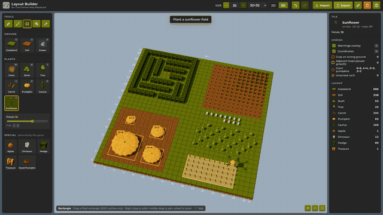
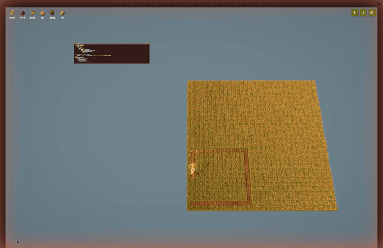

# The Farmer Was Replaced – Layout Builder

A web editor for planning farm layouts in [The Farmer Was Replaced](https://store.steampowered.com/app/2060160/The_Farmer_Was_Replaced/).
Paint grounds and plants on a grid, check the layout against the game's rules, and export it as
paste-ready Python that your drone scripts can read.



*A scripted routine: the drone builds a 32×32 farm with every tool, then the camera circles it in 3D.*


## Features

- **2D and 3D views, same editor.** Every tool, overlay, shortcut and undo step works the same in
  both; press <kbd>V</kbd> to switch. The 3D view is modelled on the game: an earth slab, olive
  grassland, ploughed soil, low-poly plants, a hovering drone and a warm sun.
- **Game-accurate data.** Grounds: Grassland, Soil. Plants: Grass, Bush, Tree (any ground) and
  Carrot, Pumpkin, Cactus, Sunflower (soil only; painting them on grassland tills it to soil).
  Special entities the game spawns (Apple, Dinosaur, Hedge, Treasure, Dead Pumpkin) are in their
  own section. The table is data-driven (`src/core/entities.js`).
- **Per-tile parameters.** Cactus size (0–9) and sunflower petals (7–15) are stored per tile, shown
  in both views (cactus height, petal count) and exported.
- **Tools.** Draw, line (<kbd>Shift</kbd> snaps to 45°), rectangle (<kbd>Shift</kbd> for outline),
  flood fill and pick (or <kbd>Alt</kbd>+click). Undo/redo with <kbd>Ctrl/⌘</kbd>+<kbd>Z</kbd>,
  <kbd>Shift</kbd>+<kbd>Ctrl/⌘</kbd>+<kbd>Z</kbd> or <kbd>Ctrl/⌘</kbd>+<kbd>Y</kbd>. Press <kbd>?</kbd>
  for all shortcuts.
- **Checks.** Soil crops on grassland (from imported data), orthogonally adjacent trees (each
  neighbour doubles growth time), the giant pumpkins your pumpkin squares will merge into, and
  cacti that aren't in sorted order (shown brown, like in the game).
- **Any size from 3×3 to 32×32**, with presets for the farm expansion sizes. Resizing keeps
  everything anchored at the south-west corner.
- **Export / import** as one paste-ready game script (with a drone route planned for few moves),
  a plain Python grid, or JSON, with a paste box. Layouts autosave to `localStorage`, and the link
  button copies a compact share URL (`#layout=…`).

Coordinates match the game: `(0, 0)` is the south-west corner, `x` grows East, `y` grows North,
and the tile at `(x, y)` is `grid[y * size + x]`.

## Using the export in the game

**Export → Game script** gives you one script to paste into a new code window in the game. Run it
and the drone plants the layout, then keeps going round the pumpkins (replanting dead ones) until
they're all grown, so full squares merge into giant pumpkins.



The script is split into sections that also work when copied on their own:

```python
# ==== Layout ====     grid_size, grid, plant_order, tend_order   (just data)
# ==== Movement ====   steps(), move_to(x, y), move_to_index()    (only the game's built-ins)
# ==== Farming ====    plant_tile(), tend_tile(), USE_WATER, USE_FERTILIZER
# ==== Run ====        plant_layout(), tend_pumpkins() and the lines that start them
```

- `grid[y * grid_size + x]` is the tile at (x, y); (0, 0) is the south-west corner, rows go south
  to north. Each tile is `{"ground": Grounds.Soil, "entity": Entities.Carrot}`, plus `"size"`
  (cactus) or `"petals"` (sunflower) where they apply. The game decides those randomly, so treat
  them as targets you can compare with `measure()`.
- `plant_order` lists the tiles that aren't empty grassland and `tend_order` the pumpkins, each
  in an order the editor planned for few drone moves. `move_to()` takes the shortest way to a
  tile, including around the farm's wrapping edges. The Export dialog shows the route length.
- Tick **Fertilize pumpkins** in the Export dialog (or set `USE_FERTILIZER = True`) to grow them
  faster with fertilizer.
- The script only names the entities your layout uses, so it runs on a save that hasn't unlocked
  the others. If the farm is smaller than the layout it prints a message and stops.

**Export → Grid only** is just the Layout part (`grid_size` and `grid`) for your own scripts.

The JSON export (`{"format": "tfwr-layout", "version": 1, "size": n, "cells": [...]}`) is the
editor's lossless format; cells use the same order. The import box accepts either format, plus the
old lowercase JSON from earlier versions of this app.

## Development

```bash
pnpm install
pnpm dev          # start the dev server
pnpm test         # unit tests for the editor core (vitest)
pnpm lint
pnpm build        # static build in dist/
pnpm icons        # re-render src/assets/icons + sprites from the 3D models (needs Chrome)
pnpm screenshot   # re-capture public/screenshot*.png (needs Chrome)
pnpm record       # record the farm-tour routine to public/demo.mp4 + demo.gif (needs Chrome, ffmpeg)
node scripts/image-to-routine.mjs picture.png --preview shot.png   # routine that paints an image
```

Layout of the code:

| Path | What it does |
| --- | --- |
| `src/core/entities.js` | Grounds, entities, parameters, size presets (data-driven) |
| `src/core/grid.js`, `tools.js` | Cell model, brushes, line/rect/flood-fill geometry |
| `src/core/editor.js` | Editor store: document, undo/redo, tools, pointer interaction |
| `src/core/validation.js` | Wrong-ground, adjacent-tree, cactus-sort and giant-pumpkin analysis |
| `src/core/io.js` | Game script, Python and JSON export/import, URL encoding |
| `src/core/route.js` | Drone route planning (fewest moves on the wrapping farm) |
| `src/core/routine.js`, `src/routines/` | Routines: scripted editor sessions played back by the drone (used for the demo video) |
| `src/render2d/` | 2D canvas renderer (tile art, sprites, overlays, zoom/pan) |
| `src/render3d/` | 3D renderer (react-three-fiber), procedural models, palette |
| `scripts/` | Icon/sprite renderer, screenshot and demo layout scripts |

Both renderers only turn pointer positions into tile coordinates and draw the editor state; all
editing behaviour lives in `src/core`, so features can't drift between the views.

## Credits

All 3D models, icons and tile art are original: they are generated from code in this repository
(`src/render3d/models.js`, `scripts/render-icons.mjs`) using a palette that mimics the game's look.
This project is not affiliated with the game or its developers.
